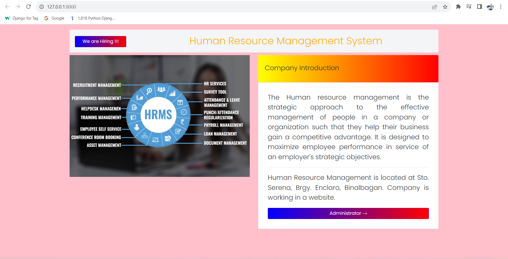
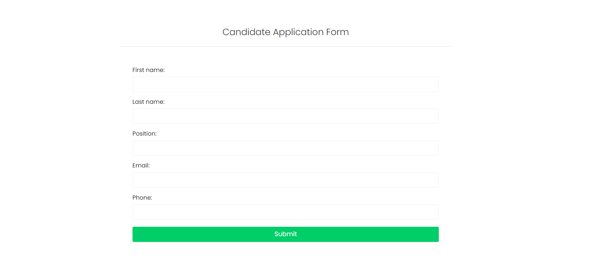
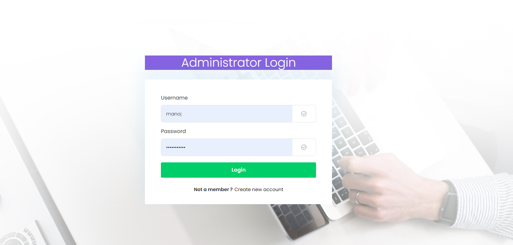
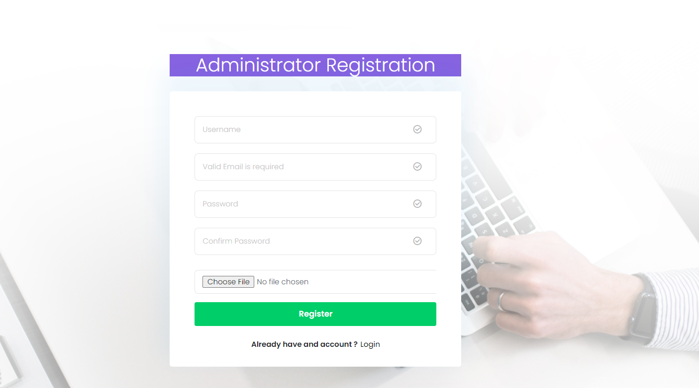
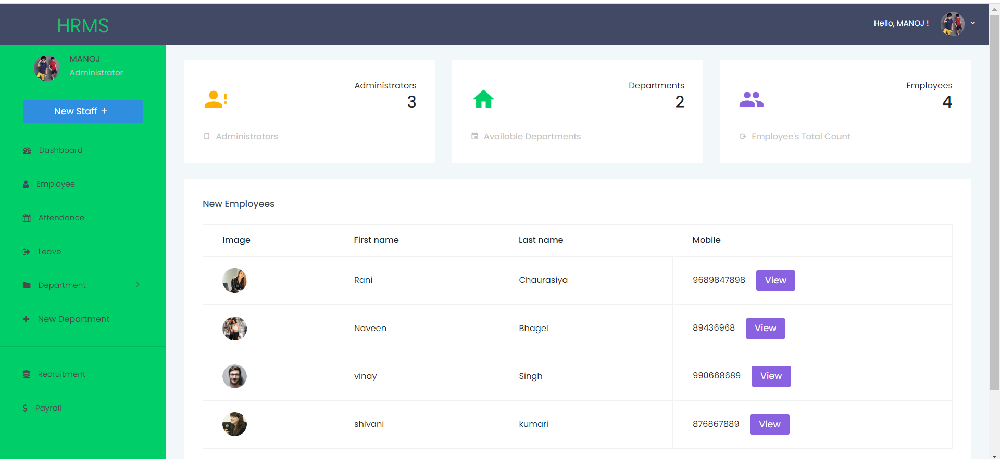

# Human Resource Management System Project in Django

A Human Resource Management System Project in Django, Keeps track of all of the employee’s information and data. We’ve created all of the employee’s crud (create, read, update, and delete) operations.

#### Moving on, This is a role-based module in which the admin can perform any operation on the data, yet the employee can only see his or her own data, so access label limitations have been added to the project.

##### Anyway, It has Admin side which allows extra features like manage employee, attendance, leave, department, recruitment and payroll.

# Project Information and Recommended Tools

### About Project	Project Details

Project Name:-	Human Resource Management System

Python version (Recommended):-	3.8 Version

Programming Language Used:-	  Python Django Language

IDE Tool (Recommended):-	      Visual Studio

Project Type:-	             Web Application

Database:-	                 MySQL

#### Human Resource Management System Project in Django overview

## Admin Features of Human Resource Management System in Django

##### Manage Employee – For the employee, The admin can add, edit, and delete employee information.

##### Salary Management – For the salary, The admin can see the list of employee salary details. Admin can update and delete the record of the employee salary.

##### Manage Leave – For the leave, the admin can see the employee who wants to leave and admin can approved or declined employee to request a leave.

##### Manage Department – For the department, The admin can add, edit, and delete department information.

##### Login – By default the admin need to login first to enable to access the system.

###### Registration – For the registration, the user needs to register first to create an account.

##### Manage Recruitment – For the recruitment, the admin can see list of all recruitment.

